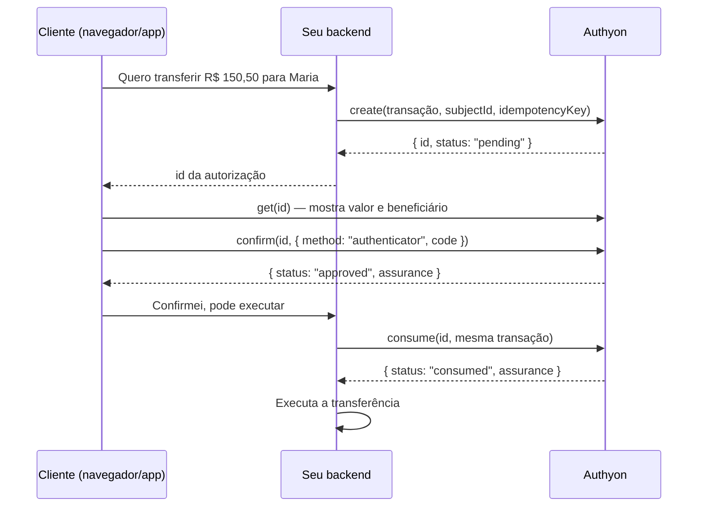

# Confirmação de transações financeiras (step-up)

Use este fluxo quando uma operação sensível — transferência, Pix, saque, troca de
beneficiário — precisa de uma prova, **no momento da operação**, de que quem está
pedindo é o próprio cliente. O cliente confirma com o código do app autenticador
(TOTP) ou com a passkey, e a aprovação fica presa **àquela transação específica**:
não serve para outro valor, outro beneficiário nem pode ser reutilizada.

Disponível a partir de `0.2.0-beta.14` em `@authyon/server` e `@authyon/auth`.

## Como funciona



1. **Seu backend cria a autorização** com os dados da transação e o id do cliente.
2. **O cliente vê a transação e confirma** digitando o código do autenticador (ou usando a passkey).
3. **Seu backend consome a autorização** reenviando a mesma transação, e só então executa a operação.

O passo 3 é obrigatório: é ele que garante que a transação executada é a mesma que o
cliente aprovou e que a aprovação é usada uma única vez.

## Pré-requisitos

- **Credencial de ambiente** (`clientId`/`clientSecret`) com o escopo
  `authyon:financial:authorize`. Sem ele, `create`, `get` e `consume` respondem `403`.
- **Cliente com segundo fator forte cadastrado**: app autenticador ou passkey.
  OTP por e-mail e recovery codes **não** são aceitos para aprovar transações.
  Use `authyon.twoFactor.status()` para saber o que o cliente tem e, se necessário,
  conduza o cadastro com `twoFactor.setupAuthenticator()` /
  `twoFactor.webauthn.registerStart()` (veja [Configuração de 2FA](./examples/twoFactorSetup.md)).

## 1. Backend: criar a autorização

```ts
import { createClient } from "@authyon/server";

const authyon = createClient({
  envKey: process.env.AUTHYON_ENV_KEY,
  clientId: process.env.AUTHYON_CLIENT_ID,
  clientSecret: process.env.AUTHYON_CLIENT_SECRET,
});

const transaction = {
  action: "pix.transfer",
  amount: 150.5,
  currency: "BRL",
  beneficiary: "Maria Silva — CPF ***.456.789-**",
  metadata: { pixKey: "maria@example.com", orderId: "order-42" },
};

const authorization = await authyon.environment.financialAuthorizations.create({
  ...transaction,
  subjectId: customerId, // id do usuário no Authyon
  idempotencyKey: "order-42", // único por transação no seu sistema
  expiresInSeconds: 300, // 60–600, padrão 300
});

// Guarde authorization.id junto do pedido e devolva-o ao frontend.
```

| Campo              | Regra                                                                             |
| ------------------ | --------------------------------------------------------------------------------- |
| `action`           | obrigatório, até 100 caracteres (ex.: `pix.transfer`, `withdrawal`)               |
| `amount`           | maior que zero, até 15 dígitos inteiros e 4 casas decimais                        |
| `currency`         | código ISO 4217 de 3 letras (`BRL`, `USD`)                                        |
| `beneficiary`      | obrigatório, até 256 caracteres — é o texto que o cliente lê antes de confirmar   |
| `metadata`         | opcional, objeto JSON de até 16 KiB; entra no hash da transação                   |
| `tenantId`         | opcional; exige que o cliente confirme numa sessão desse tenant                   |
| `idempotencyKey`   | obrigatório, até 128 caracteres; enviado no header `Idempotency-Key`              |
| `expiresInSeconds` | opcional, entre 60 e 600                                                          |

**Idempotência:** repetir o `create` com a mesma `idempotencyKey` e a mesma transação
devolve a mesma autorização (seguro para retry). A mesma chave com uma transação
diferente falha com `idempotency_conflict`.

## 2. Frontend: o cliente confirma com o código

```ts
import { createClient, AuthyonError, ErrorCodes } from "@authyon/auth";

const authyon = createClient({ envKey: "pk_live_..." });

// Mostre exatamente o que está sendo aprovado.
const pending = await authyon.financialAuthorizations.get(authorizationId);
render(`Transferir ${pending.amount} ${pending.currency} para ${pending.beneficiary}?`);

try {
  await authyon.financialAuthorizations.confirm(authorizationId, {
    method: "authenticator",
    code: codeTypedByCustomer, // 6 dígitos do app autenticador
  });
  // Aprovado: avise seu backend para consumir e executar.
} catch (cause) {
  if (!(cause instanceof AuthyonError)) throw cause;

  if (cause.is(ErrorCodes.InvalidSecondFactorCode)) {
    showError(`Código inválido. Tentativas restantes: ${cause.extensions.attemptsRemaining}`);
  } else if (cause.is(ErrorCodes.VerificationAttemptsExhausted)) {
    showError("Muitas tentativas. A transação foi recusada; inicie novamente.");
  } else if (cause.is(ErrorCodes.MethodNotEnrolled)) {
    redirectToTwoFactorSetup();
  } else {
    throw cause;
  }
}
```

Se o cliente desistir, registre a recusa:

```ts
await authyon.financialAuthorizations.reject(authorizationId);
```

### Com passkey

A passkey é o método mais forte (resistente a phishing) e gera `acr`
`urn:authyon:loa:3`.

```ts
const { ceremonyToken, optionsJson } =
  await authyon.financialAuthorizations.webauthnOptions(authorizationId);

const credential = await navigator.credentials.get({
  publicKey: PublicKeyCredential.parseRequestOptionsFromJSON(JSON.parse(optionsJson)),
});

await authyon.financialAuthorizations.confirm(authorizationId, {
  method: "webauthn",
  webAuthn: { ceremonyToken, assertionJson: JSON.stringify(credential) },
});
```

### Backend com sessão (BFF)

Se o token do cliente fica no seu servidor, use o mesmo fluxo pelo `@authyon/server`:

```ts
await authyon.user(customerAccessToken).financialAuthorizations.confirm(authorizationId, {
  method: "authenticator",
  code,
});
```

### Confirmação sem código (sessão recente)

`confirm(id)` sem o segundo argumento aprova somente se a sessão do cliente foi
autenticada com passkey ou app autenticador **nos últimos 5 minutos**. Caso contrário
a API responde `step_up_required`. Prefira enviar o código: a prova fica ligada à
transação, não ao login.

## 3. Backend: consumir antes de executar

```ts
const result = await authyon.environment.financialAuthorizations.consume(
  authorization.id,
  transaction, // exatamente os mesmos campos enviados ao create
);

// result.assurance → { acr, amr, authTime }: guarde como evidência da operação.
await executeTransfer(transaction, { evidence: result.assurance });
```

- Só autorizações `approved` e dentro do prazo podem ser consumidas, e **uma única vez**.
- Qualquer diferença em `action`, `amount`, `currency`, `beneficiary` ou `metadata`
  falha com `transaction_mismatch`. O valor é normalizado para 4 casas e as chaves de
  `metadata` são ordenadas, então `150.5` e `150.50` são equivalentes.
- Para acompanhar o estado sem consumir, use `environment.financialAuthorizations.get(id)`.

## Estados

| Status     | Significado                                              |
| ---------- | -------------------------------------------------------- |
| `pending`  | aguardando o cliente                                     |
| `approved` | cliente confirmou; pronto para `consume`                 |
| `denied`   | cliente recusou ou esgotou as 5 tentativas de código     |
| `consumed` | já usada pelo seu backend; não pode ser usada de novo    |
| `expired`  | passou do `expiresInSeconds` sem ser aprovada/consumida  |

## Erros

Todos chegam como `AuthyonError`. Compare por `code` (ou pelas constantes de
`ErrorCodes`); dados extras ficam em `error.extensions`.

| `code`                            | Status | Quando                                                       | O que fazer                                        |
| --------------------------------- | ------ | ------------------------------------------------------------ | -------------------------------------------------- |
| `invalid_code`                    | 400    | código ou passkey não conferem                               | pedir de novo; ver `extensions.attemptsRemaining`  |
| `verification_attempts_exhausted` | 409    | 5ª falha; a autorização virou `denied`                       | criar uma nova autorização                         |
| `method_not_enrolled`             | 400    | cliente não tem esse fator cadastrado                        | conduzir o cadastro do autenticador/passkey        |
| `step_up_required`                | 403    | `confirm` sem código e sessão não é recente/forte            | pedir o código ao cliente                          |
| `invalid_authorization_state`     | 409    | autorização já decidida, consumida ou expirada               | ler `extensions.status`; criar nova se necessário  |
| `transaction_mismatch`            | 400    | `consume` com transação diferente da aprovada                | **não executar**; investigar                       |
| `authorization_not_consumable`    | 409    | `consume` de autorização não aprovada, expirada ou já usada  | **não executar**                                   |
| `idempotency_conflict`            | 409    | mesma `idempotencyKey` com outra transação                   | usar outra chave                                   |
| `invalid_request`                 | 400    | campo inválido (veja `detail`)                               | corrigir a entrada                                 |
| `rate_limited`                    | 429    | mais de 20 confirmações em 5 minutos por cliente             | aguardar `retryAfter`                              |

## Segurança

- **Sempre consuma antes de executar** e trate qualquer erro do `consume` como
  "não executar".
- **Mostre a transação** (valor e beneficiário vindos de `get`) antes de pedir o código,
  para o cliente saber o que está aprovando.
- Cada autorização aceita **até 5 tentativas** de código; depois disso é recusada.
- Um código TOTP só é aceito uma vez — não é possível reutilizá-lo em outra autorização.
- Guarde `assurance` (`acr`, `amr`, `authTime`) junto da operação como trilha de auditoria.
  O Authyon também registra `user.two_factor.verified` / `user.two_factor.failed` com o id
  da autorização.
- A credencial com `authyon:financial:authorize` deve ficar só no backend que executa
  as operações financeiras.

## Referência HTTP

Para integrações sem o SDK. Todas as chamadas levam o header `X-Authyon-Environment`.

| Quem    | Método e rota                                      | Autenticação                         |
| ------- | -------------------------------------------------- | ------------------------------------ |
| Backend | `POST /env/authorizations` + `Idempotency-Key`     | token de ambiente (client credentials) |
| Backend | `GET /env/authorizations/{id}`                     | token de ambiente                    |
| Backend | `POST /env/authorizations/{id}/consume`            | token de ambiente                    |
| Cliente | `GET /auth/authorizations/{id}`                    | token do cliente                     |
| Cliente | `POST /auth/authorizations/{id}/webauthn/options`  | token do cliente                     |
| Cliente | `POST /auth/authorizations/{id}/confirm`           | token do cliente                     |
| Cliente | `POST /auth/authorizations/{id}/reject`            | token do cliente                     |

Corpo do `confirm`:

```json
{ "method": "authenticator", "code": "123456" }
```

```json
{ "method": "webauthn", "webAuthn": { "ceremonyToken": "...", "assertionJson": "{...}" } }
```
