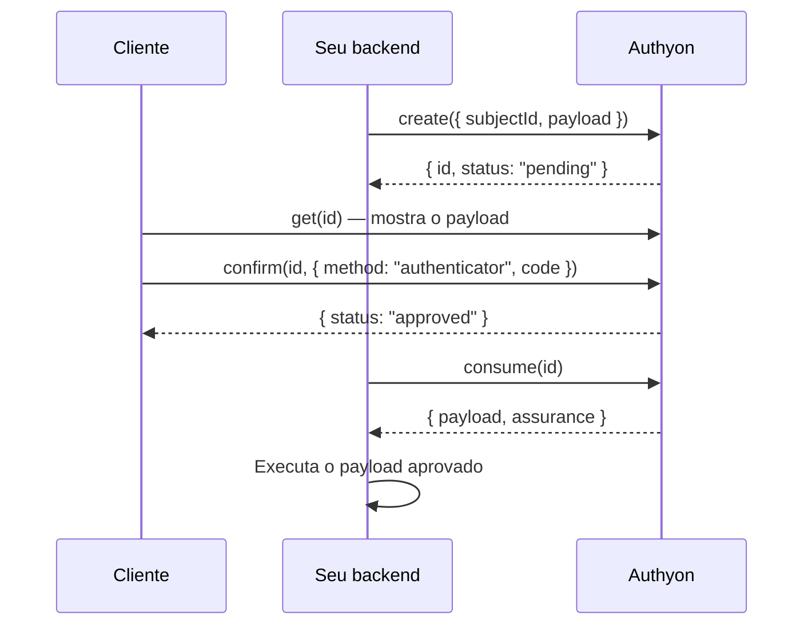

# Confirmação com OTP e step-up

Use estes recursos quando uma operação sensível — transferência, Pix, saque, troca de
e-mail, visualizar dados do cartão — precisa de uma prova, **no momento da operação**,
de que quem está pedindo é o próprio cliente.

Há dois caminhos, ambos no `@authyon/server` a partir de `0.2.0-beta.14`:

| Caminho                                         | Quando usar                                                                 |
| ----------------------------------------------- | --------------------------------------------------------------------------- |
| [`verifyOtp`](#validar-o-otp)                   | Você só quer saber se o código do app autenticador está certo. Uma chamada. |
| [Autorizações](#autorizações-com-payload)       | Você quer a aprovação presa a um conteúdo (valor, destino…) e de uso único. |

## Pré-requisitos

- **Credencial de ambiente** (`clientId`/`clientSecret`) com o escopo
  `authyon:financial:authorize`. Sem ele as chamadas respondem `403`.
- **Cliente com app autenticador cadastrado** (Google Authenticator, Authy, 1Password…).
  Use `authyon.twoFactor.status()` no `@authyon/auth` para saber se ele tem e, se
  necessário, conduza o cadastro com `twoFactor.setupAuthenticator()` (veja
  [Configuração de 2FA](./examples/twoFactorSetup.md)). As autorizações também aceitam passkey.

## Validar o OTP

Um único método. Seu backend recebe o código digitado pelo cliente e pergunta ao
Authyon se ele é válido:

```ts
import { createClient } from "@authyon/server";

const authyon = createClient({
  envKey: process.env.AUTHYON_ENV_KEY,
  clientId: process.env.AUTHYON_CLIENT_ID,
  clientSecret: process.env.AUTHYON_CLIENT_SECRET,
});

const result = await authyon.environment.users.verifyOtp(customerId, code);

if (result.valid) {
  // código correto: é o cliente — execute a operação
} else {
  // código errado
  console.log(`Tentativas restantes: ${result.attemptsRemaining}`);
}
```

Resposta:

```jsonc
// código correto
{ "valid": true, "userId": "…", "method": "otp", "verifiedAt": "2026-10-01T12:00:03Z" }

// código errado
{ "valid": false, "attemptsRemaining": 3 }
```

Regras aplicadas pelo Authyon:

- O código precisa ter 6 dígitos e valer para o momento atual (tolerância de ±30 s).
- **Cada código é aceito uma única vez**: o mesmo código enviado de novo volta `valid: false`.
- **5 erros seguidos bloqueiam a verificação por 15 minutos** para aquele usuário
  (`rate_limited`, com `retryAfter`/`extensions.retryAfterSeconds` e header `Retry-After`). Um acerto zera a contagem. O
  contador é o mesmo dos códigos digitados no `confirm` das autorizações.
- Se o contador de tentativas estiver indisponível, a verificação é recusada
  (`temporarily_unavailable`, status 503) em vez de liberar tentativas sem limite.
- Toda tentativa é auditada (`user.two_factor.verified` / `user.two_factor.failed`).

> O `customerId` deve vir da sessão validada no seu backend, nunca de um campo
> enviado pelo navegador.

### Exemplo em uma rota (Next.js)

```ts
// app/api/transfers/route.ts
import { AuthyonError } from "@authyon/server";
import { authyon } from "@/lib/authyon-server";

export async function POST(request: Request) {
  const token = request.headers.get("authorization")?.replace(/^Bearer /, "");
  const { valid, user } = token ? await authyon.validate(token) : { valid: false, user: null };
  if (!valid || !user) return Response.json({ error: "unauthorized" }, { status: 401 });

  const { code, amount, pixKey } = await request.json();

  try {
    const otp = await authyon.environment.users.verifyOtp(user.id, code);
    if (!otp.valid)
      return Response.json(
        { error: "invalid_code", attemptsRemaining: otp.attemptsRemaining },
        { status: 400 },
      );
  } catch (cause) {
    if (cause instanceof AuthyonError && cause.code === "rate_limited")
      return Response.json({ error: "locked", retryAfter: cause.extensions.retryAfterSeconds }, { status: 429 });
    if (cause instanceof AuthyonError && cause.code === "method_not_enrolled")
      return Response.json({ error: "enable_authenticator" }, { status: 400 });
    throw cause;
  }

  await executePix({ amount, pixKey });
  return Response.json({ status: "executed" });
}
```

## Autorizações com payload

Use quando a aprovação precisa ficar **presa a um conteúdo** e valer **uma única vez**.
O `payload` é um objeto JSON livre — você decide o formato. O Authyon guarda, mostra
de volta ao cliente e calcula um hash dele; o `consume` devolve exatamente o que foi
aprovado.



### 1. Backend cria

```ts
const authorization = await authyon.environment.financialAuthorizations.create({
  subjectId: customer.id,
  payload: {
    type: "pix",
    amount: 150.5,
    to: { name: "Maria Silva", pixKey: "maria@example.com" },
  },
  expiresInSeconds: 300, // opcional, 60–600
  idempotencyKey: orderId, // opcional, evita duplicar em retry
});
// devolva authorization.id ao frontend
```

| Campo              | Regra                                                                  |
| ------------------ | ---------------------------------------------------------------------- |
| `subjectId`        | obrigatório — o usuário que precisa aprovar                            |
| `payload`          | opcional, qualquer objeto JSON de até 16 KiB (padrão `{}`)             |
| `tenantId`         | opcional; exige que o cliente aprove numa sessão desse tenant          |
| `expiresInSeconds` | opcional, entre 60 e 600 (padrão 300)                                  |
| `idempotencyKey`   | opcional, até 128 caracteres; mesma chave + mesmo payload = mesmo `id` |

### 2. Cliente aprova (`@authyon/auth`)

```ts
const pending = await authyon.financialAuthorizations.get(authorizationId);
// mostre pending.payload ao cliente

await authyon.financialAuthorizations.confirm(authorizationId, {
  method: "authenticator",
  code: "123456",
});
```

Com passkey:

```ts
const { ceremonyToken, optionsJson } =
  await authyon.financialAuthorizations.webauthnOptions(authorizationId);
const credential = await navigator.credentials.get({
  publicKey: PublicKeyCredential.parseRequestOptionsFromJSON(JSON.parse(optionsJson)),
});
await authyon.financialAuthorizations.confirm(authorizationId, {
  method: "webauthn",
  webAuthn: { ceremonyToken, assertionJson: JSON.stringify(credential) },
});
```

Para recusar: `authyon.financialAuthorizations.reject(authorizationId)`. Cada
autorização aceita até 5 tentativas de código; depois é recusada
(`verification_attempts_exhausted`).

Se o token do cliente fica no seu servidor (BFF), o mesmo está em
`authyon.user(accessToken).financialAuthorizations`.

### 3. Backend consome e executa

```ts
const { payload, assurance } = await authyon.environment.financialAuthorizations.consume(
  authorizationId,
);
await execute(payload); // execute o payload devolvido, não um vindo do navegador
```

Se preferir que o Authyon confira o payload que você tem em mãos, envie-o:
`consume(authorizationId, payloadSalvo)` — qualquer diferença falha com `payload_mismatch`.
Só autorizações `approved` e dentro do prazo podem ser consumidas, e uma única vez.

### Estados

| Status     | Significado                                           |
| ---------- | ----------------------------------------------------- |
| `pending`  | aguardando o cliente                                  |
| `approved` | cliente aprovou; pronto para `consume`                |
| `denied`   | cliente recusou ou esgotou as 5 tentativas            |
| `consumed` | já usada; não pode ser usada de novo                  |
| `expired`  | passou do prazo sem ser aprovada/consumida            |

## Erros

Todos chegam como `AuthyonError`; compare por `code` ou pelas constantes de `ErrorCodes`.
Dados extras ficam em `error.extensions`.

| `code`                            | Status | Quando                                                  |
| --------------------------------- | ------ | ------------------------------------------------------- |
| `method_not_enrolled`             | 400    | o cliente não tem app autenticador (ou passkey)         |
| `rate_limited`                    | 429    | `verifyOtp` bloqueado após 5 erros seguidos             |
| `user_not_found`                  | 404    | usuário não existe neste ambiente                       |
| `user_disabled`                   | 403    | usuário desativado, suspenso ou excluído                |
| `temporarily_unavailable`         | 503    | contador de tentativas indisponível; tente de novo      |
| `insufficient_scope`              | 403    | credencial sem o escopo `authyon:financial:authorize`   |
| `authorization_not_found`         | 404    | autorização inexistente ou de outro usuário/credencial  |
| `invalid_code`                    | 400    | `confirm` com código ou passkey errados                 |
| `verification_attempts_exhausted` | 409    | 5ª falha no `confirm`; autorização recusada             |
| `step_up_required`                | 403    | `confirm` sem código e sessão não recente/forte         |
| `invalid_authorization_state`     | 409    | autorização já decidida, consumida ou expirada          |
| `payload_mismatch`                | 400    | `consume` com payload diferente do aprovado             |
| `authorization_not_consumable`    | 409    | `consume` de autorização não aprovada ou já usada       |
| `idempotency_conflict`            | 409    | mesma `idempotencyKey` com outro payload                |
| `invalid_request`                 | 400    | entrada inválida (veja `detail`)                        |

Lembre-se: `verifyOtp` com código errado **não** lança erro — devolve `valid: false`.

## Segurança

- **Valide a sessão no backend** e use o id do usuário dela no `verifyOtp` e no
  `subjectId`; nunca aceite esse id vindo do navegador.
- **Execute só depois do `consume`** e execute o `payload` que ele devolve.
- **Não coloque segredos no `payload`** (número completo de cartão, CVV, senhas, tokens):
  ele é guardado como está, mostrado ao cliente e entra na trilha de auditoria.
- **Mostre o `payload` ao cliente** antes de pedir o código; renderize-o como texto
  (sem HTML), porque o conteúdo vem do seu próprio backend mas é livre.
- **A credencial com `authyon:financial:authorize` fica só no backend.** Com ela é possível
  testar códigos de qualquer usuário do ambiente, sempre dentro do limite de tentativas.

## Referência HTTP

Todas as chamadas levam o header `X-Authyon-Environment`.

| Quem    | Método e rota                                     | Autenticação          |
| ------- | ------------------------------------------------- | --------------------- |
| Backend | `POST /env/users/{userId}/otp/verify` `{ code }`  | token de ambiente     |
| Backend | `POST /env/authorizations` (+ `Idempotency-Key`)  | token de ambiente     |
| Backend | `GET /env/authorizations/{id}`                    | token de ambiente     |
| Backend | `POST /env/authorizations/{id}/consume`           | token de ambiente     |
| Cliente | `GET /auth/authorizations/{id}`                   | token do cliente      |
| Cliente | `POST /auth/authorizations/{id}/webauthn/options` | token do cliente      |
| Cliente | `POST /auth/authorizations/{id}/confirm`          | token do cliente      |
| Cliente | `POST /auth/authorizations/{id}/reject`           | token do cliente      |
