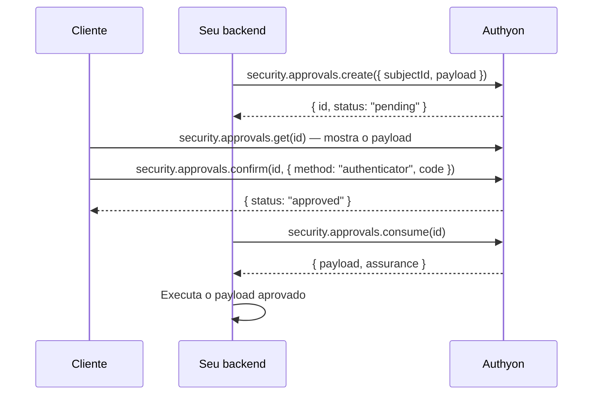

# Segurança: OTP e aprovações (`authyon.security`)

Tudo que prova, **no momento da operação**, que quem está pedindo é o próprio cliente
fica em `authyon.security` — transferência, Pix, saque, troca de e-mail, visualizar
dados do cartão. Disponível a partir de `0.2.0-beta.15`.

```text
@authyon/server (seu backend)                @authyon/auth (cliente) · server.user(token)
authyon.security                             authyon.security
├── otp                                      ├── methods()
│   └── check(userId, code)                  └── approvals
└── approvals                                    ├── get(id)
    ├── create({ subjectId, payload })           ├── webauthnOptions(id)
    ├── get(id)                                  ├── confirm(id, { method, code })
    └── consume(id, payload?)                    └── reject(id)
```

| Recurso                                      | Quando usar                                                                 |
| -------------------------------------------- | --------------------------------------------------------------------------- |
| [`security.methods`](#securitymethods)     | Saber quais métodos de segurança o usuário tem ativos (OTP, e-mail, passkey, SSO). |
| [`security.otp`](#securityotp)               | Você só quer saber se o código do app autenticador está certo. Uma chamada. |
| [`security.approvals`](#securityapprovals)   | A aprovação precisa ficar presa a um conteúdo (valor, destino…) e valer uma vez. |

## Pré-requisitos

- **Credencial de ambiente** (`clientId`/`clientSecret`) com o escopo
  `authyon:financial:authorize`. Sem ele as chamadas respondem `insufficient_scope` (403).
- **Cliente com app autenticador cadastrado** (Google Authenticator, Authy, 1Password…).
  Use `authyon.twoFactor.status()` no `@authyon/auth` para saber se ele tem e, se
  necessário, conduza o cadastro com `twoFactor.setupAuthenticator()` (veja
  [Configuração de 2FA](./examples/twoFactorSetup.md)). As aprovações também aceitam passkey.

```ts
import { createClient } from "@authyon/server";

const authyon = createClient({
  envKey: process.env.AUTHYON_ENV_KEY,
  clientId: process.env.AUTHYON_CLIENT_ID,
  clientSecret: process.env.AUTHYON_CLIENT_SECRET,
});
```

## `security.methods`

Quais métodos de segurança a conta tem ativos. Vem no campo `security` do `GET /auth/me`
(`authyon.user.me()`) e do `POST /auth/validate` (`authyon.validate(token)` no backend);
`security.methods()` é o atalho que devolve só esse objeto.

```ts
const methods = await authyon.security.methods(); // @authyon/auth, usuário logado
// ou no backend: (await authyon.validate(token)).user?.security

if (!methods.authenticator) {
  // peça para o cliente ativar o app autenticador antes de liberar o Pix
}
```

```jsonc
{
  "password": true, // tem senha (false em contas criadas só por SSO ou magic link)
  "authenticator": true, // app autenticador (OTP)
  "emailCode": false, // código por e-mail
  "passkey": true,
  "passkeyCount": 2,
  "recoveryCodes": 8, // códigos de recuperação ainda não usados
  "sso": ["google"], // provedores SSO vinculados
  "twoFactor": true // algum segundo fator ativo (autenticador, e-mail ou passkey)
}
```

Os valores mudam na hora quando o usuário ativa ou desativa um método, cadastra ou remove
passkey, vincula ou desvincula um SSO ou usa um código de recuperação.

## `security.otp`

### `check(userId, code)`

Seu backend recebe o código digitado pelo cliente e pergunta ao Authyon se ele é válido.
Código errado **não** lança erro: volta `valid: false`.

```ts
const result = await authyon.security.otp.check(customerId, code);

if (result.valid) {
  // código correto: é o cliente — execute a operação
} else if (result.sessionsRevoked) {
  // 3º erro seguido: o cliente foi deslogado de todos os dispositivos
} else {
  console.log(`Tentativas restantes: ${result.attemptsRemaining}`);
}
```

Resposta (`OtpCheckResult`):

```jsonc
// código correto
{ "valid": true, "userId": "…", "method": "otp", "verifiedAt": "2026-10-01T12:00:03Z" }

// código errado
{ "valid": false, "attemptsRemaining": 2, "sessionsRevoked": false }

// 3º código errado seguido
{ "valid": false, "attemptsRemaining": 0, "sessionsRevoked": true }
```

Regras aplicadas pelo Authyon:

- O código precisa ter 6 dígitos e valer para o momento atual (tolerância de ±30 s).
- **Cada código é aceito uma única vez**: o mesmo código enviado de novo volta `valid: false`.
- **3 erros seguidos deslogam o usuário de todos os dispositivos.** A contagem é por
  usuário e soma os códigos errados no 2FA do login, em `security.otp.check` e em
  `security.approvals.confirm` (um acerto zera; erros com mais de 1 hora deixam de contar).
  No 3º erro todas as sessões são encerradas na hora, inclusive access tokens já emitidos,
  e o evento `user.session.revoked_for_otp_failures` vai para a auditoria e para os webhooks.
  O login com 2FA responde `user.2fa.too_many_failures` e `confirm` responde `session_revoked`.
- **5 erros seguidos bloqueiam a verificação por 15 minutos** para aquele usuário
  (`rate_limited`, com `retryAfter`, `extensions.retryAfterSeconds` e header `Retry-After`).
- `attemptsRemaining` conta quantos erros faltam para a primeira consequência (logout ou
  bloqueio) e vale `0` quando o usuário acabou de ser deslogado.
- Se o contador de tentativas estiver indisponível, a verificação é recusada
  (`temporarily_unavailable`, status 503) em vez de liberar tentativas sem limite.
- Toda tentativa é auditada (`user.two_factor.verified` / `user.two_factor.failed`).

> O `customerId` deve vir da sessão validada no seu backend, nunca de um campo
> enviado pelo navegador.

#### Exemplo em uma rota (Next.js)

```ts
// app/api/transfers/route.ts
import { AuthyonError, ErrorCodes } from "@authyon/server";
import { authyon } from "@/lib/authyon-server";

export async function POST(request: Request) {
  const token = request.headers.get("authorization")?.replace(/^Bearer /, "");
  const { valid, user } = token ? await authyon.validate(token) : { valid: false, user: null };
  if (!valid || !user) return Response.json({ error: "unauthorized" }, { status: 401 });

  const { code, amount, pixKey } = await request.json();

  try {
    const otp = await authyon.security.otp.check(user.id, code);
    if (!otp.valid)
      return Response.json(
        otp.sessionsRevoked
          ? { error: "signed_out" }
          : { error: "invalid_code", attemptsRemaining: otp.attemptsRemaining },
        { status: otp.sessionsRevoked ? 401 : 400 },
      );
  } catch (cause) {
    if (!(cause instanceof AuthyonError)) throw cause;
    if (cause.is(ErrorCodes.RateLimited))
      return Response.json({ error: "locked", retryAfter: cause.retryAfter }, { status: 429 });
    if (cause.is(ErrorCodes.MethodNotEnrolled))
      return Response.json({ error: "enable_authenticator" }, { status: 400 });
    throw cause;
  }

  await executePix({ amount, pixKey });
  return Response.json({ status: "executed" });
}
```

## `security.approvals`

Use quando a aprovação precisa ficar **presa a um conteúdo** e valer **uma única vez**.
O `payload` é um objeto JSON livre — você decide o formato. O Authyon guarda, mostra
de volta ao cliente e calcula um hash dele; `consume` devolve exatamente o que foi
aprovado.



### 1. Backend cria — `create(input)`

```ts
const approval = await authyon.security.approvals.create({
  subjectId: customer.id,
  payload: {
    type: "pix",
    amount: 150.5,
    to: { name: "Maria Silva", pixKey: "maria@example.com" },
  },
  expiresInSeconds: 300, // opcional, 60–600
  idempotencyKey: orderId, // opcional, evita duplicar em retry
});
// devolva approval.id ao frontend
```

| Campo              | Regra                                                                  |
| ------------------ | ---------------------------------------------------------------------- |
| `subjectId`        | obrigatório — o usuário que precisa aprovar                            |
| `payload`          | opcional, qualquer objeto JSON de até 16 KiB (padrão `{}`)             |
| `tenantId`         | opcional; exige que o cliente aprove numa sessão desse tenant          |
| `expiresInSeconds` | opcional, entre 60 e 600 (padrão 300)                                  |
| `idempotencyKey`   | opcional, até 128 caracteres; mesma chave + mesmo payload = mesmo `id` |

### 2. Cliente confirma — `@authyon/auth`

```ts
const pending = await authyon.security.approvals.get(approvalId);
// mostre pending.payload ao cliente

await authyon.security.approvals.confirm(approvalId, {
  method: "authenticator",
  code: "123456",
});
```

Com passkey:

```ts
const { ceremonyToken, optionsJson } = await authyon.security.approvals.webauthnOptions(approvalId);
const credential = await navigator.credentials.get({
  publicKey: PublicKeyCredential.parseRequestOptionsFromJSON(JSON.parse(optionsJson)),
});
await authyon.security.approvals.confirm(approvalId, {
  method: "webauthn",
  webAuthn: { ceremonyToken, assertionJson: JSON.stringify(credential) },
});
```

Para recusar: `authyon.security.approvals.reject(approvalId)`. Cada aprovação aceita até
5 tentativas de código; depois é recusada (`verification_attempts_exhausted`). Os códigos
errados também contam para o logout após 3 erros seguidos.

Se o token do cliente fica no seu servidor (BFF), os mesmos métodos estão em
`authyon.user(accessToken).security.approvals`.

### 3. Backend consome e executa — `consume(id, payload?)`

```ts
const { payload, assurance } = await authyon.security.approvals.consume(approvalId);
await execute(payload); // execute o payload devolvido, não um vindo do navegador
```

Se preferir que o Authyon confira o payload que você tem em mãos, envie-o:
`consume(approvalId, payloadSalvo)` — qualquer diferença falha com `payload_mismatch`.
Só aprovações `approved` e dentro do prazo podem ser consumidas, e uma única vez.

### Estados (`ApprovalStatus`)

| Status     | Significado                                           |
| ---------- | ----------------------------------------------------- |
| `pending`  | aguardando o cliente                                  |
| `approved` | cliente aprovou; pronto para `consume`                |
| `denied`   | cliente recusou ou esgotou as 5 tentativas            |
| `consumed` | já usada; não pode ser usada de novo                  |
| `expired`  | passou do prazo sem ser aprovada/consumida            |

## Tipos

| Tipo                      | Onde                                                     |
| ------------------------- | -------------------------------------------------------- |
| `SecurityMethods`         | retorno de `security.methods` e campo `security` do perfil |
| `OtpCheckResult`          | retorno de `security.otp.check`                          |
| `Approval`                | retorno de `create`, `get`, `confirm` e `reject`         |
| `CreateApprovalInput`     | entrada de `security.approvals.create`                   |
| `ConsumedApproval`        | retorno de `security.approvals.consume`                  |
| `ConfirmApprovalInput`    | segundo argumento de `security.approvals.confirm`        |
| `ApprovalWebAuthnOptions` | retorno de `security.approvals.webauthnOptions`          |
| `ApprovalPayload`         | o objeto livre que você aprova                           |
| `ApprovalAssurance`       | evidência da aprovação (`acr`, `amr`, `authTime`)        |
| `ApprovalStatus`          | estados acima                                            |

## Erros

Todos chegam como `AuthyonError`; compare com `error.is(ErrorCodes.X)` ou por `code`.
Dados extras ficam em `error.extensions`.

| `ErrorCodes`                    | `code`                            | Status | Quando                                              |
| ------------------------------- | --------------------------------- | ------ | --------------------------------------------------- |
| `MethodNotEnrolled`             | `method_not_enrolled`             | 400    | o cliente não tem app autenticador (ou passkey)     |
| `RateLimited`                   | `rate_limited`                    | 429    | bloqueado após 5 erros seguidos                     |
| `UserNotFound`                  | `user_not_found`                  | 404    | usuário não existe neste ambiente                   |
| `UserDisabled`                  | `user_disabled`                   | 403    | usuário desativado, suspenso ou excluído            |
| `TemporarilyUnavailable`        | `temporarily_unavailable`         | 503    | contador de tentativas indisponível; tente de novo  |
| `SessionRevoked`                | `session_revoked`                 | 401    | 3º código errado seguido no `confirm`               |
| `TwoFactorTooManyFailures`      | `user.2fa.too_many_failures`      | 403    | 3º código errado seguido no login com 2FA           |
| `InsufficientScope`             | `insufficient_scope`              | 403    | credencial sem o escopo `authyon:financial:authorize` |
| `ApprovalNotFound`              | `authorization_not_found`         | 404    | aprovação inexistente ou de outro usuário/credencial |
| `InvalidSecondFactorCode`       | `invalid_code`                    | 400    | `confirm` com código ou passkey errados             |
| `VerificationAttemptsExhausted` | `verification_attempts_exhausted` | 409    | 5ª falha no `confirm`; aprovação recusada           |
| `StepUpRequired`                | `step_up_required`                | 403    | `confirm` sem código e sessão não recente/forte     |
| `InvalidApprovalState`          | `invalid_authorization_state`     | 409    | aprovação já decidida, consumida ou expirada        |
| `PayloadMismatch`               | `payload_mismatch`                | 400    | `consume` com payload diferente do aprovado         |
| `ApprovalNotConsumable`         | `authorization_not_consumable`    | 409    | `consume` de aprovação não aprovada ou já usada     |
| `IdempotencyConflict`           | `idempotency_conflict`            | 409    | mesma `idempotencyKey` com outro payload            |
| —                               | `invalid_request`                 | 400    | entrada inválida (veja `detail`)                    |

## Segurança

- **Valide a sessão no backend** e use o id do usuário dela em `otp.check` e no
  `subjectId`; nunca aceite esse id vindo do navegador.
- **Execute só depois do `consume`** e execute o `payload` que ele devolve.
- **Não coloque segredos no `payload`** (número completo de cartão, CVV, senhas, tokens):
  ele é guardado como está, mostrado ao cliente e entra na trilha de auditoria.
- **Mostre o `payload` ao cliente** antes de pedir o código; renderize-o como texto
  (sem HTML), porque o conteúdo vem do seu próprio backend mas é livre.
- **A credencial com `authyon:financial:authorize` fica só no backend.** Com ela é possível
  testar códigos de qualquer usuário do ambiente, sempre dentro do limite de tentativas.

## Referência HTTP

Para integrações sem o SDK. Todas as chamadas levam o header `X-Authyon-Environment`.

| Método do SDK                          | Rota                                              | Autenticação      |
| -------------------------------------- | ------------------------------------------------- | ----------------- |
| `security.otp.check`                   | `POST /env/users/{userId}/otp/verify` `{ code }`  | token de ambiente |
| `security.approvals.create`            | `POST /env/authorizations` (+ `Idempotency-Key`)  | token de ambiente |
| `security.approvals.get` (backend)     | `GET /env/authorizations/{id}`                    | token de ambiente |
| `security.approvals.consume`           | `POST /env/authorizations/{id}/consume`           | token de ambiente |
| `security.approvals.get` (cliente)     | `GET /auth/authorizations/{id}`                   | token do cliente  |
| `security.approvals.webauthnOptions`   | `POST /auth/authorizations/{id}/webauthn/options` | token do cliente  |
| `security.approvals.confirm`           | `POST /auth/authorizations/{id}/confirm`          | token do cliente  |
| `security.approvals.reject`            | `POST /auth/authorizations/{id}/reject`           | token do cliente  |
